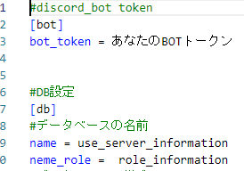
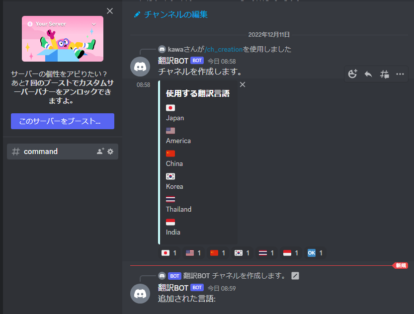
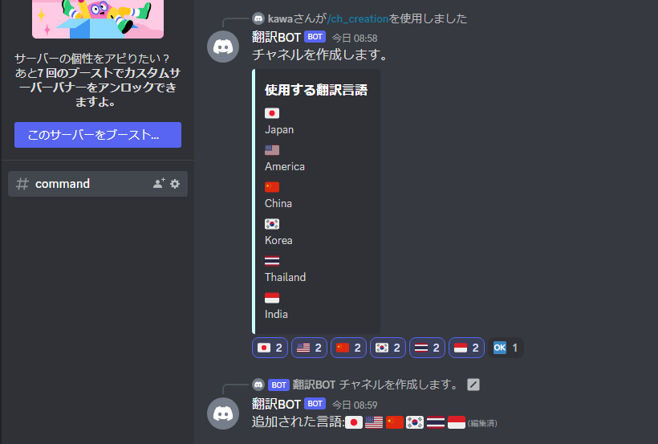
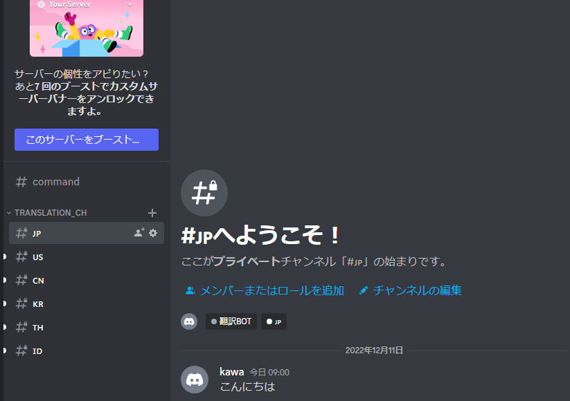
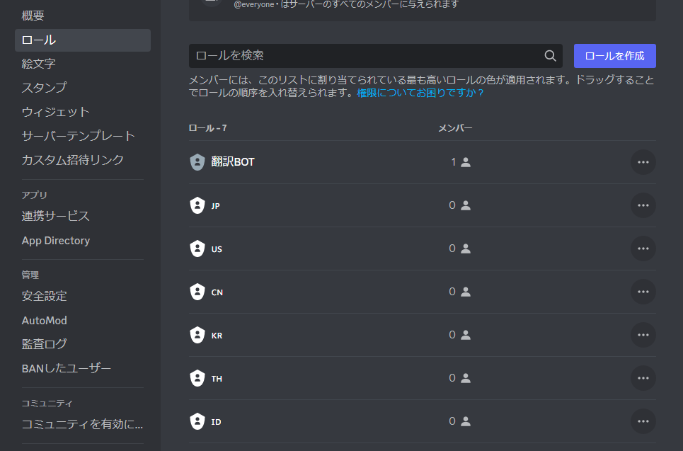
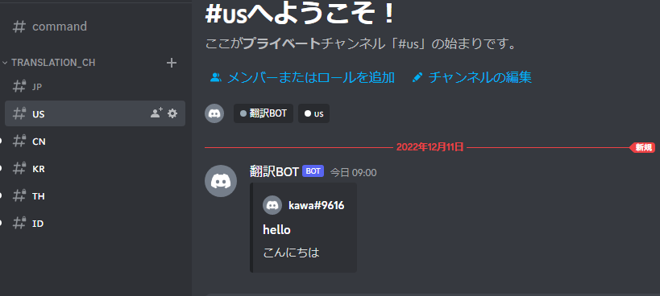
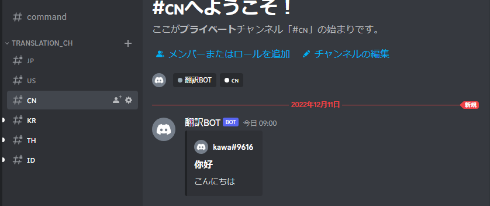
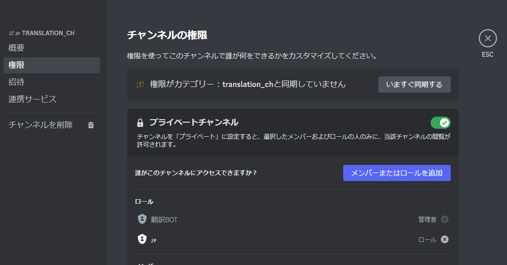

<h1>ディスコード翻訳ボット</h1>

## 目次
- [環境](#environment)
- [使用ライブラリ](#library)
- [設定](#setting)
- [使用方法](#usage)
- [コマンド実行](#com)
- [翻訳方法](#translation)

<h2 id="environment">環境</h2>
<p>windows10</p>
<p>Python 3.9.5 </p>
<p>discord.py 2.1.0</p>

<h2 id="library">使用ライブラリ</h2>
<p>discrd.py</p>
<p>googletrans</p>

<h3>パッケージインストール</h3>

```
python.exe -m pip install --upgrade pip
```

↑↑↑　しなくても大丈夫です。 ↑↑↑</p>

```
pip install --upgrade discord
```

```
pip install --upgrade googletrans
```

<h2 id="setting">設定</h2>
<p>discord_bot\config\bot.ini の bot_token にあなたのBOTのトークンを入れてください。</p>


<h2 id="usage">使用方法</h2>
<p id = "com">/ch_creation を実行するとチャンネル作成することができます。</p>

<p>追加したい言語のリアクションを押します。(追加したら最後にOKを押します。)</p>

<p>OKを押した後チャンネルとロールが作成されます。</p>



<h2 id="translation">翻訳方法</h2>
<p>任意のチャンネルで発言すると、それぞれの言語用チャットに翻訳されたメッセージが送信されます。</p>




<h2 id="authority">権限設定</h2>
<p>通知が多くなることを避けるために権限による閲覧制限をしています。</p>
<p>(権限設定はチャンネル作成時にBOTが自動で行います。)</p>



